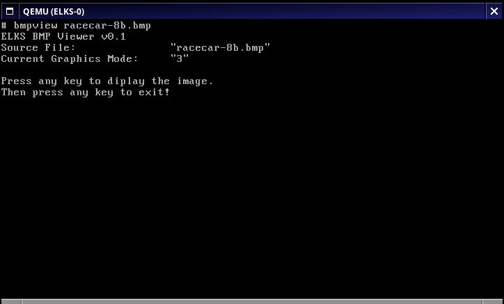
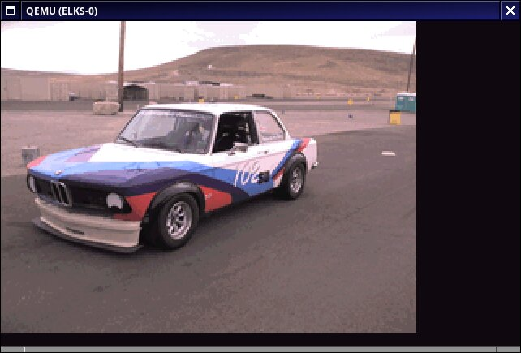
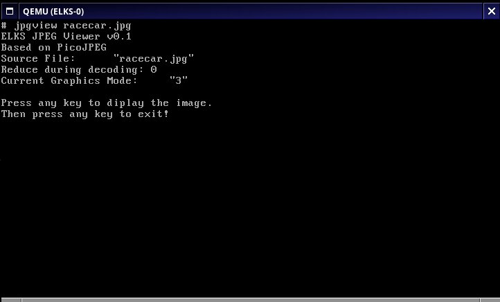
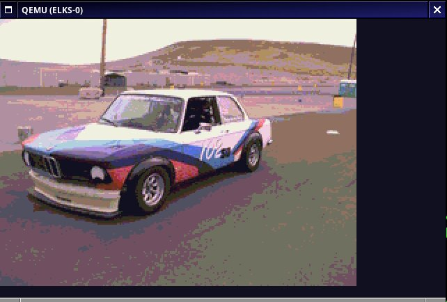
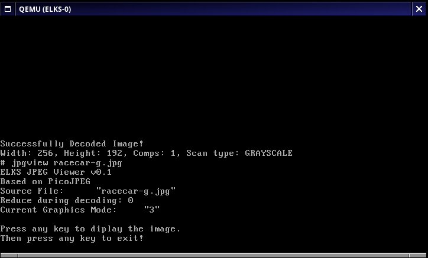
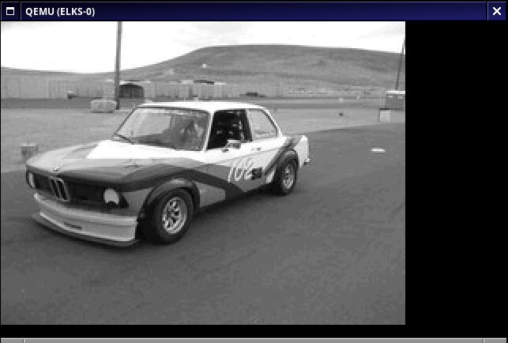

# ELKS viewer


An optimized image viewer which runs on ELKS on Intel 8088 CPU or better.

ELKS Viewer is a set of tools composed by standalone viewers:
- bmpview: Supports 1, 4, 8 and 24 bits BMP (run-length encoding also supported).
- ppmview: Supports PPM and PGM formats.
- jpgview: A JPEG viewer which supports baseline sequential greyscale, or YCbCr H1V1, H1V2, H2V1, and H2V2 chroma sampling factors. Progressive JPEG's are not supported.

JPEG decoding uses PicoJPEG. Source "graphics.c" contains the graphics operation routines. 

Open Watcom v2 and C86 compilers are supported, and the software is linked to ELKS libc. 

Folder "3rdparty" contains external software: CPIG (Color Palette Inference Generator) to create optimized palettes for a given image, and a dithering implementation. Not used.








# Usage

```
 Usage: {jpg,bmp,ppm}view [-m mode] [source_file]
    source_file: Image file to decode.
    mode: IBM PC BIOS mode, in hexadecimal - don't need to write the "0x".
          Supported modes:
          - 0x10 (EGA/VGA 640x350 4-bit)
          - 0x12 (VGA 640x480 4-bit)
          - 0x13 (VGA 320x200 8-bit, default)
```

# Build


## Open Watcom v2

In order to build ELKS viewer tools, you can use Open Watcom v2. ELKS Viewer needs also ELKS libc compiled for OpenWatcom. For it, you need ELKS source code, available at
https://github.com/ghaerr/elks/ and follow the steps to build the ELKS libc as explained here: https://github.com/ghaerr/elks/wiki/Using-OpenWatcom-C-with-ELKS .

On Linux, for example, do the following (ELKS source at ~/elks, and ELKS Viewer at ~/elks-viewer, Open Watcom installed in default location):
```
cd ~/elks
. env.sh
. /usr/bin/watcom/owsetenv.sh
cd libc
make -f watcom.mk clean
make -f watcom.mk
cd ~/elks-viewer
```

Then, with the setup ready (in the same shell, with environment variables properly set), type:
```
make -f Makefile.owc
```

## ELKS 8086 Toolchain Cross Build

For cross-building ELKS viewer tools with C86, you need ELKS source code, available at
https://github.com/ghaerr/elks/ and install 8086-toolchain tools, available here: https://github.com/ghaerr/8086-toolchain/ . Follow the instructions here: https://github.com/ghaerr/elks/wiki/Setting-up-the-8086-toolchain-(C86-compiler-and-tools) .

On Linux, for example, do the following (ELKS source at ~/elks, and ELKS Viewer at ~/elks-viewer, C86 directory "/8086-toolchain"):

```
cd ~/elks
. env.sh
export C86=/8086-toolchain
export PATH=$C86/host-bin:$PATH
cd libc
make -f c86.mk clean
make -f c86.mk
cd ~/elks-viewer
```
Then, with the setup ready (in the same shell, with environment variables properly set), type:
```
make -f Makefile.c86
```

## ELKS 8086 Toolchain Native Build

For nativelly building ELKS viewer tools with C86, you need ELKS with 8086-toolchain installed.

On ELKS, do:

```
cd ~/elks-viewer
make
```

# Author

ELKS Viewer is developed by Rafael Diniz.
